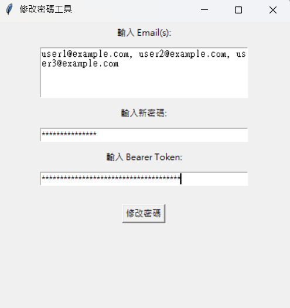

# pw-changer-tool

A lightweight Python-based GUI utility designed to batch update user passwords via REST API. This tool is built with **Tkinter** for the interface and **Requests** for API communication.

## Key Features
* **Graphical User Interface**: Easy-to-use input fields, no command-line knowledge required.
* **Batch Processing**: Supports updating multiple emails at once (comma-separated).
* **Security**: Supports Bearer Token authentication for privacy.
* **Instant Feedback**: Displays a detailed success/failure report in a popup window after execution.

## Project Structure
```bash
PasswordChangerTool/
│
├── dist/                         # Contains executable files
│   └── PasswordChanger.exe       # Windows executable
├── build/                        # Compilation artifacts
├── src/                          # Python source code
│   └── PasswordChanger.py        # Main script
├── image/                        # GUI image
│   └── InputExample.png          # Input Example
└── PasswordChanger.spec          # PyInstaller configuration file
```

## Getting Started

### 1. Prerequisites
* Python 3.x
* Required Packages

### 2. Local Setup
```bash
# Installation
pip install requests
```
```bash
# Run Python Script
cd src
python PasswordChanger.py
```
### 3. Input Format Examples


Email Input:
```bash
user1@example.com, user2@example.com, user3@example.com
```
Password:
```bash
NewPassword123!
```
Bearer Token:
```bash
eyJhbGciOiJIUzI1NiIsInR5cCI6IkpXVCJ9...
```
## Build Executable (.exe)

### 1. Install PyInstaller
```bash
# Installation
pip install pyinstaller
```

### 2. Package as Executable
```bash
# Run packaging command
python -m PyInstaller --onefile --noconsole PasswordChanger.py
```

## How it Works
* **API Integration**: Sends PUT requests to the remote SSO service.
* **URL Formatting**: Automatically injects each email into the API endpoint template.
* **Error Handling**: Uses try...except blocks to handle network timeouts or API errors gracefully without crashing the application.

## Important Notes
* Ensure you have a valid Bearer Token with the necessary permissions to modify user passwords.
* When entering multiple emails, please separate them with a standard comma (,).


